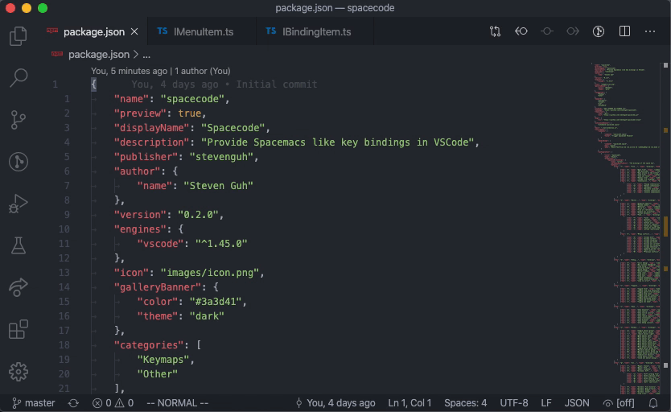

# Spacecode (Preview)


This extension is inspired by spacemacs and aiming to provide similar experience in VSCode. An action menu trigger by space key is implemented to reduce memorization of shortcuts. You can change the editor group, change the file language, and check git status without leaving your keyboard. This provides speed to shortcut while minimizing typing comparing to fuzzy search in the command palette or shortcut memorizing.

## Features

- Spacemacs like action menu to reduce memorization of shortcuts
- All menu items are customizable
- The the menu key is customizable



## Requirements

- [VSCode Vim](https://marketplace.visualstudio.com/items?itemName=vscodevim.vim) (required for default space key)
- [GitLens](https://marketplace.visualstudio.com/items?itemName=eamodio.gitlens) (required for default bindings)
- [edmagit](https://marketplace.visualstudio.com/items?itemName=kahole.magit) and its Vim bindings (required for default bindings)

## Installation
After the installation of the extension, you will need to manually configure to set up the trigger for the action menu.

### I am using VSCode Vim
Add the trigger as follows in `settings.json`. This following example is to let VSCode Vim to capture the `space` key and trigger the action menu in normal mode and visual mode.
> To access `settings.json`, you can search `Setting` in the command list with `Ctl+Shift+P` or `Cmd+Shift+P` and select `Preference: Open Settings (JSON)`.

> If you have existing config for `vim.normalModeKeyBindingsNonRecursive` or `vim.visualModeKeyBindingsNonRecursive`, make sure you add to the array instead of replace them.

```json
"vim.normalModeKeyBindingsNonRecursive": [
  {
    "before": ["<space>"],
    "commands": ["spacecode.space"]
  }
],
"vim.visualModeKeyBindingsNonRecursive": [
  {
    "before": ["<space>"],
    "commands": ["spacecode.space"]
  }
]
```

### I am *not* using VSCode Vim
Add the trigger as follows in `keybindings.json`. This following json is an example to bind `alt+space` to the action menu when a text editor is in focus.

> To access `keybindings.json`, you can search `Keyboard` in the command list with `Ctl+Shift+P` or `Cmd+Shift+P` and select `Preference: Open Keyboard Shortcuts (JSON)`.

```json
{
  "key": "alt+space",
  "command": "spacecode.space",
  "when": "editorTextFocus"
},
```

## Customization

### Change the actions in the menu
To customize the menu, copy the default `spacecode.bindings` value in `package.json` in this repo and put the updated `spacecode.bindings` config in your own `setting.json`.

> The actions are subject to change before `1.0.0`. If you find something you think it should bind to a particular key, or you want some particular function, please open an issue as a feature request.

## Release Notes

See [CHANGELOG.md](CHANGELOG.md)

## Contribution
All feature requests and help are welcome. Please open an issue to track.

## Credits
Thanks @kahole for his implementation of quick pick menu in edamagit. 

Icons made by [Icongeek26](https://www.flaticon.com/authors/icongeek26) from [www.flaticon.com](www.flaticon.com)